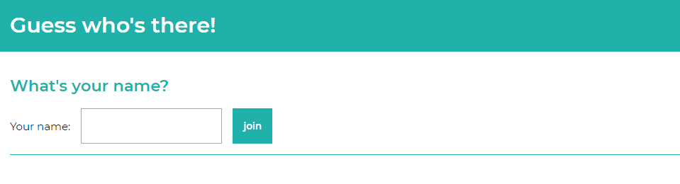

# Guess who's there!
This repository contains the code for a simple real-time chat application that uses [socket.io](https://socket.io/) to establish connections.

## Concept
The idea behind this project is that 4 friends can have a chat conversation, but when it starts, they are not aware of who is who. By chatting, they have to find out the right names for the right users in 10 minutes. The person that gets most names right wins.

In playing this game they can find out how well they actually know each other.

## Installation
1. First clone this repository with `https://github.com/lennartdeknikker/basic-chat-application.git`.
2. Then install the necessary dependencies with `npm install`.
3. Use `npm run dev` to run the application using nodemon to keep track of changes while you're coding.

## Features
- [x] joining the server
- [x] waiting room
- [x] anonymous chatroom
- [x] countdown timer
- [x] winner listing
- [ ] highscores
- [ ] restart
- [ ] multiple rooms
- [ ] variable amount of chat members

## Events
### Emitted by the client
- **connection:** connects new clients to the server.
- **disconnect**: tells the server what to do on disconnection.
- **join**: creates a new user object.
- **ready**: sets users status to ready.
- **message**: broadcasts a message to every connected client.
- **time is up**: tells the server the time is up.
- **points counted**: tells the server how many a user got right.

### Emitted by the server
- **notification**: tells the client if there's a connection.
- **error message**: tells the client if there's an error on the server.
- **new user joined**: tells all clients a new user has joined the room.
- **change in userdata**: tells all clients there's changes in userdata and the interface needs to be updated.
- **start**: tells the clients to start the chat.
- **new message**: tells the clients someone said something in the chat.
- **time to count**: tells all clients, the time is up.
- **game ended**: tells all clients the game ended.

## License
This project is licensed under the terms of the MIT license.